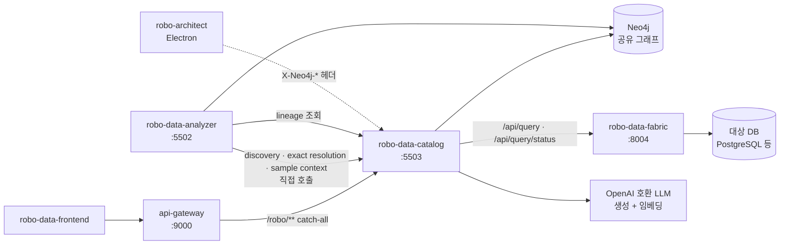
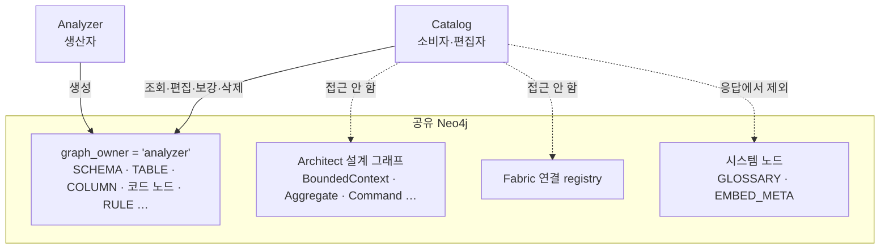
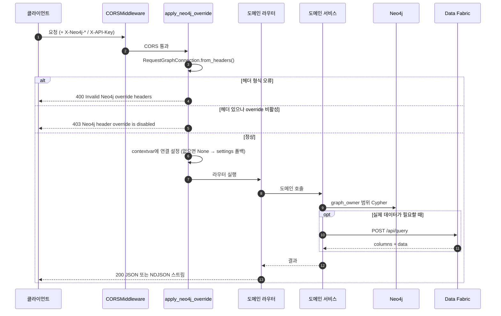
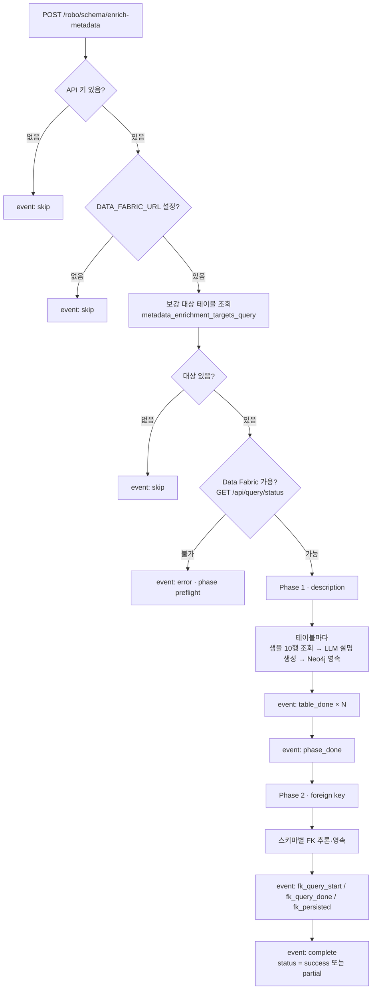
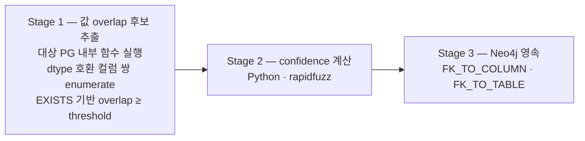
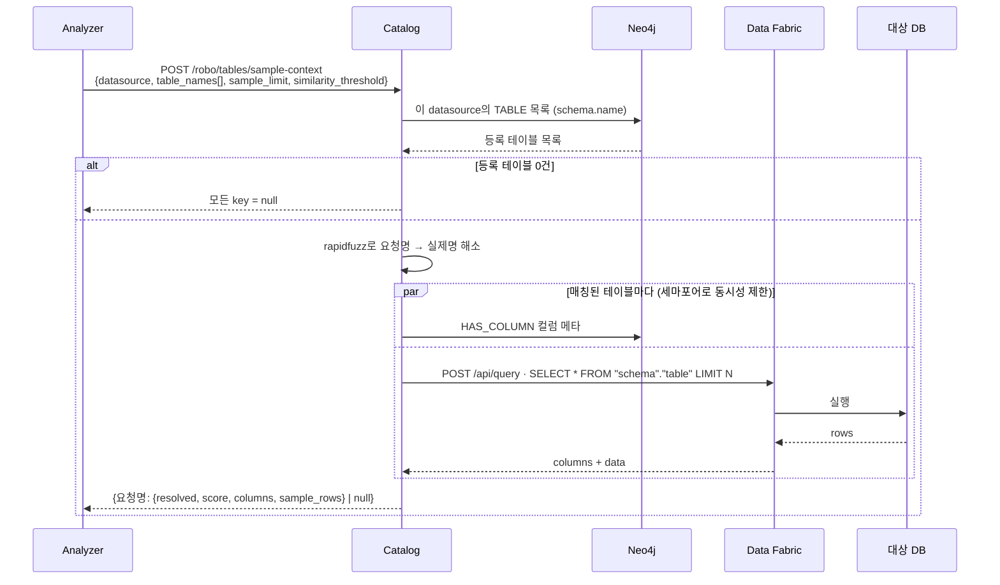

# ROBO Data Catalog

Analyzer가 만든 **분석 지식 그래프를 조회·편집·보강**하는 FastAPI 마이크로서비스입니다.
스키마 카탈로그(테이블·컬럼·관계), 코드↔테이블 참조 근거, 시맨틱 검색, LLM 기반 설명 보강,
값 기반 FK 추론, SQL 리니지 추출, 분석용 테이블 샘플 컨텍스트를 제공합니다.

대상 데이터베이스의 접속 정보와 실제 SQL 실행은 **소유하지 않습니다** — Data Fabric의
읽기 전용 쿼리 API를 통해서만 실 데이터에 접근합니다.

---

## 목차

1. [무엇을 하는 서비스인가](#1-무엇을-하는-서비스인가)
2. [시스템 안에서의 위치](#2-시스템-안에서의-위치)
3. [책임 경계와 소유권](#3-책임-경계와-소유권)
4. [아키텍처](#4-아키텍처)
5. [요청 처리 흐름](#5-요청-처리-흐름)
6. [API](#6-api)
7. [메타데이터 보강 파이프라인](#7-메타데이터-보강-파이프라인)
8. [FK 추론](#8-fk-추론)
9. [리니지](#9-리니지)
10. [샘플 컨텍스트](#10-샘플-컨텍스트)
11. [시맨틱 검색과 벡터화](#11-시맨틱-검색과-벡터화)
12. [Data Fabric 연동 계약](#12-data-fabric-연동-계약)
13. [설정](#13-설정)
14. [프로젝트 구조](#14-프로젝트-구조)
15. [실행](#15-실행)
16. [테스트](#16-테스트)
17. [문제 해결](#17-문제-해결)

---

## 1. 무엇을 하는 서비스인가

Analyzer는 그래프를 **쓰는** 쪽이고, Catalog는 그 그래프를 **읽고 다듬는** 쪽입니다.

| 기능 | 내용 |
|---|---|
| **그래프 조회** | 분석 그래프 전체, 특정 테이블의 관련 테이블 서브그래프, 데이터 존재 여부 |
| **스키마 카탈로그** | 테이블 목록·검색, 컬럼 목록, 테이블 관계 목록 |
| **참조 근거** | 어떤 프로시저·함수가 이 테이블(또는 이 컬럼)을 참조하는지, 프로시저의 구문별 AI 설명 |
| **스키마 편집** | 관계 추가·삭제, 테이블·컬럼 설명 직접 수정 |
| **설명 보강** | 실제 샘플 행을 근거로 LLM이 테이블·컬럼 설명을 생성 (NDJSON 스트림) |
| **FK 추론** | 값 겹침 + 컬럼명 유사도 + distinct 충분도를 통합한 confidence 기반 자동 FK 검출 |
| **리니지** | ETL SQL에서 소스→타겟 데이터 흐름 추출과 그래프 투영 |
| **샘플 컨텍스트** | Analyzer가 링킹으로 찾아낸 테이블명 목록을 실제 테이블에 매칭하고 컬럼·샘플 행 반환 |
| **시맨틱 검색** | 테이블 설명 임베딩 기반 의미 검색과 스키마 벡터화 |
| **그래프 삭제** | Analyzer 소유 노드만 범위로 삭제 |

---

## 2. 시스템 안에서의 위치



| 상대 | 방향 | 내용 |
|---|---|---|
| `api-gateway` | 인바운드 | `/robo/**` catch-all(접두 형태)이 이 서비스로 옵니다. 프론트엔드는 게이트웨이를 거칩니다 |
| `robo-data-analyzer` | 인바운드 (**게이트웨이 미경유**) | `GET /robo/tables/discovery`로 전체 datasource snapshot을 page 단위 소비하고, `POST /robo/tables/resolve-context`로 코드의 데이터 객체를 exact 해소합니다. 기존 sample-context도 유지합니다 |
| `robo-architect` (Electron) | 인바운드 | `X-Neo4j-*` 헤더로 요청별 연결을 지정합니다(옵션이 켜져 있을 때만) |
| `Neo4j` | 아웃바운드 | 분석 그래프를 직접 읽고 씁니다 |
| `robo-data-fabric` | 아웃바운드 | `/api/query`, `/api/query/status`. **MindsDB나 대상 DB에 직접 연결하지 않습니다** |
| LLM | 아웃바운드 | 설명 생성(chat)과 임베딩. OpenAI 호환 |

---

## 3. 책임 경계와 소유권



| 서비스 | 책임 |
|---|---|
| **Analyzer** | 소스와 DDL을 분석해 `graph_owner="analyzer"` 그래프를 **생성** |
| **Catalog** | 그 그래프를 **조회·편집·보강**하고 검색·리니지·샘플 컨텍스트 API 제공 |
| **Data Fabric** | 데이터소스 연결 등록, MindsDB 연결 관리, 실제 DB 쿼리 실행 |

소유권 계약은 `graph/scope.py` 한 곳에 있습니다.

| 함수 | 역할 |
|---|---|
| `owner_predicate(alias)` | `<alias>.graph_owner = 'analyzer'` — 모든 조회·삭제 쿼리가 이 술어로 범위를 좁힙니다 |
| `visible_predicate(alias)` | `NOT <alias>:EMBED_META AND NOT <alias>:GLOSSARY` — 시스템 노드를 사용자 응답에서 제외합니다 |

두 술어 모두 Cypher 별칭이 식별자 패턴(`^[A-Za-z_][A-Za-z0-9_]*$`)에 맞는지 검증한 뒤에만
문자열을 만듭니다. `DELETE /robo/delete/`도 `graph_owner`로 범위가 제한되어 Architect 설계
그래프와 Fabric registry는 보존됩니다.

---

## 4. 아키텍처

```mermaid
flowchart TB
    subgraph api[api — HTTP 경계]
        RG[graph.py]
        RS[schema.py]
        RSE[schema_edit.py]
        RSR[search.py]
        RL[lineage.py]
        RT[table_samples.py]
        RE[enrichment.py]
        GC[graph_connection.py<br/>Depends: X-Neo4j-* override]
        ER[errors.py]
    end

    CON[contracts/<br/>Pydantic request·response]

    subgraph domain[도메인]
        subgraph graph[graph/]
            Q[queries.py<br/>그래프 조회]
            SQ[schema_queries.py<br/>스키마·참조 조회]
            SC[schema_commands.py<br/>스키마 편집]
            DEL[deletes.py]
            SCOPE[scope.py<br/>소유권 술어]
            DBC[database.py<br/>CatalogGraphDatabase]
            CONN[connection.py<br/>요청별 연결 contextvar]
        end
        subgraph enr[enrichment/]
            ORC[orchestrator.py<br/>NDJSON 스트림]
            DESC[description.py<br/>LLM 설명 생성·영속]
            FK[foreign_keys.py<br/>FK 추론]
            EVT[events.py]
        end
        subgraph lin[lineage/]
            LQ[queries.py]
            LX[sql_extract.py]
        end
        subgraph smp[samples/]
            CTX[context.py]
            RES[resolver.py<br/>rapidfuzz 매칭]
        end
        SEM[search/semantic.py]
    end

    subgraph integ[integrations/]
        DF[data_fabric.py<br/>DataFabricQueryGateway]
        EMB[embedding.py]
        LLMC[llm.py]
    end

    subgraph sh[shared/]
        SET[config/settings.py]
        LOG[observability/logger.py]
    end

    N4[(Neo4j)]
    FAB[Data Fabric]
    LLMS[LLM]

    api --> CON
    api --> GC
    RG --> Q
    RG --> DEL
    RS --> SQ
    RSE --> SC
    RSE --> SEM
    RSR --> SEM
    RL --> LQ
    LQ --> LX
    RT --> CTX
    CTX --> RES
    RE --> ORC
    ORC --> DESC
    ORC --> FK
    ORC --> DF
    CTX --> DF
    DESC --> LLMC
    SEM --> EMB
    graph --> DBC --> N4
    DF --> FAB
    LLMC --> LLMS
    EMB --> LLMS
    domain --> SET
    domain --> LOG
```

**레이어 규칙**

| 레이어 | 규칙 |
|---|---|
| `api/` | HTTP 경계만. 도메인 로직 없음. 모든 라우터가 `prefix=/robo` + `Depends(apply_neo4j_override)` |
| `contracts/` | 공개 request/response 모델. Pydantic 검증(길이·패턴·범위)이 여기서 끝남 |
| `graph/`·`enrichment/`·`lineage/`·`samples/`·`search/` | 도메인. Cypher와 알고리즘 |
| `integrations/` | 외부 서비스 경계. Data Fabric·임베딩·LLM 클라이언트 생성이 각각 한 곳 |
| `shared/` | 설정과 로깅 |

**기술 스택** — FastAPI 0.115 · uvicorn 0.34 · neo4j 5.28 · aiohttp · openai + langchain ·
rapidfuzz · numpy · lxml. 버전 2.0.0.

---

## 5. 요청 처리 흐름



**요청별 Neo4j 연결 override**

| 헤더 | 필수 | 기본 |
|---|:---:|---|
| `X-Neo4j-Uri` | 이것이 있어야 override 발동 | — |
| `X-Neo4j-User` | | `neo4j` |
| `X-Neo4j-Password` | | 빈 문자열 |
| `X-Neo4j-Database` | | 미지정 시 settings 기본 DB |

검증 규칙: URI 스킴은 `bolt` · `bolt+s` · `bolt+ssc` · `neo4j` · `neo4j+s` · `neo4j+ssc`만
허용, 호스트가 있어야 하고 URI에 사용자·비밀번호를 담을 수 없으며 길이 2048자 이하,
`system` 데이터베이스는 금지입니다. `X-Neo4j-Uri`가 없으면 override 없이 `.env` 설정을
씁니다.

**오류 응답** — 도메인 예외는 각 라우터에서 `500 {"detail": ..., "error_type": ...}` 형태로
변환되며, 처리되지 않은 `RuntimeError`는 앱 레벨 핸들러가
`500 {"detail": "Catalog operation failed", "error_type": "RuntimeError"}`로 바꿉니다.

---

## 6. API

모든 도메인 경로의 접두는 `/robo`입니다. Swagger는 `/docs`, ReDoc은 `/redoc`.

### 헬스

| 메서드 | 경로 | 응답 |
|---|---|---|
| `GET` | `/` | `{"status":"ok","service":"robo-data-catalog","version":"2.0.0"}` |
| `GET` | `/health` | `{"status":"healthy", ...}` |

### 그래프

| 메서드 | 경로 | 설명 |
|---|---|---|
| `GET` | `/robo/check-data/` | Analyzer 소유 그래프 데이터 존재 여부 |
| `GET` | `/robo/graph/` | 분석 그래프 전체 — `{"Nodes": [...], "Relationships": [...]}` |
| `GET` | `/robo/graph/related-tables/{table_name}` | 특정 테이블과 연결된 테이블·관계 — `{"tables": [...], "relationships": [...]}` |
| `DELETE` | `/robo/delete/?include_files=false` | Analyzer 소유 노드 `DETACH DELETE`. `include_files=true`면 Catalog 데이터 디렉터리도 초기화 |

`/robo/graph/`는 임베딩처럼 **길이 128 이상인 수치 배열 속성**을 응답에서 제외하고, 시스템
노드(`GLOSSARY`·`EMBED_META`)도 제외합니다. 파일 삭제 대상 경로는 Catalog 데이터 디렉터리
안으로 검증된 뒤에만 지워집니다.

### 스키마 조회

| 메서드 | 경로 | 파라미터 |
|---|---|---|
| `GET` | `/robo/schema/tables` | `search`, `schema`, `limit`(기본 100) |
| `GET` | `/robo/schema/tables/{table_name}/columns` | `schema`(선택 — 미지정/`public`이면 이름·fqn 기준 매칭) |
| `GET` | `/robo/schema/tables/{table_name}/references` | `schema`(**필수** — 없으면 400), `column_name`(선택) |
| `GET` | `/robo/schema/procedures/{procedure_name}/statements` | `file_directory`(선택) |
| `GET` | `/robo/schema/relationships` | — |

응답 모델

| 모델 | 필드 |
|---|---|
| `SchemaTableInfo` | `name`, `table_schema`, `datasource`, `logical_name`, `description`, `description_source`, `analyzed_description`, `column_count` |
| `SchemaColumnInfo` | `name`, `table_name`, `dtype`, `nullable`, `description`, `description_source`, `analyzed_description` |
| `SchemaRelationshipInfo` | `from_table`, `from_schema`, `from_column`, `to_table`, `to_schema`, `to_column`, `relationship_type`, `description` |

`description_source`는 그 설명이 DDL 주석·코드 분석·카탈로그 중 어디에서 왔는지를 나타냅니다.

### 스키마 편집

| 메서드 | 경로 | 인증 | 본문·파라미터 |
|---|---|:---:|---|
| `POST` | `/robo/schema/relationships` | | `AddRelationshipRequest` |
| `DELETE` | `/robo/schema/relationships` | | 쿼리 `from_table`·`from_column`·`to_table`·`to_column`(필수), `from_schema`·`to_schema`(기본 빈값) |
| `PUT` | `/robo/schema/tables/{table_name}/description` | `X-API-Key` | `TableDescriptionUpdateRequest` |
| `PUT` | `/robo/schema/tables/{table_name}/columns/{column_name}/description` | `X-API-Key` | `ColumnDescriptionUpdateRequest` |
| `POST` | `/robo/schema/vectorize` | `X-API-Key` | `VectorizeRequest` |

`AddRelationshipRequest.relationship_type`은 `FK_TO_TABLE`(기본) · `ONE_TO_ONE` ·
`ONE_TO_MANY` · `MANY_TO_ONE` · `MANY_TO_MANY` 중 하나입니다.
`TableDescriptionUpdateRequest`는 `schema` 별칭(기본 `"public"`)을 허용합니다.
`X-API-Key` 헤더가 없으면 `400`입니다.

### 검색

| 메서드 | 경로 | 인증 | 본문 |
|---|---|:---:|---|
| `POST` | `/robo/schema/semantic-search` | `X-API-Key` | `{"query": str(1~2000자), "limit": 1~100 기본 10}` |

### 샘플 컨텍스트

Analyzer가 사용하는 데이터 객체 경계는 세 가지이며 서로 합치지 않습니다.

| 메서드 | 경로 | 책임 |
|---|---|---|
| `GET` | `/robo/tables/discovery` | datasource 전체 table identity를 immutable snapshot으로 봉인하고 deterministic page 제공 |
| `POST` | `/robo/tables/resolve-context` | 코드에서 발생한 schema/object/link/column reference를 Fabric exact batch로 해소 |
| `POST` | `/robo/tables/sample-context` | 기존 이름 목록의 fuzzy sample context 호환 경계 |

Discovery 첫 요청은 `datasource`, `sample_limit`, `page_size`만 보냅니다. 응답의 opaque
`snapshot`과 `next_cursor`를 후속 요청에 함께 보내며, `page_size`는 전송 단위일 뿐 전체 table
상한이 아닙니다. 응답은 `catalog-table-discovery-page/v1`, 고정 `total_tables`, contiguous
`page_index`, quote-aware table·column identity를 포함합니다. 마지막 page만 `next_cursor=null`입니다.
snapshot/cursor 불일치·만료·중복 identity·malformed Fabric success는 부분 inventory로 낮추지 않고
실패합니다. snapshot과 cursor는 graph나 LLM 입력이 아닌 transport bookkeeping입니다.

`resolve-context`는 입력 key를 보존하며 중복 identity를 Fabric 호출 전에 합칩니다. exact metadata
근거가 부족한 항목은 unresolved로 반환하고 fuzzy 점수로 confirmed하지 않습니다.

| 메서드 | 경로 | 본문 |
|---|---|---|
| `POST` | `/robo/tables/sample-context` | `SampleContextRequest` |

```json
{
  "datasource": "prod_main",
  "table_names": ["ORDERS", "ORD_ITEM"],
  "sample_limit": 5,
  "similarity_threshold": 85.0
}
```

| 필드 | 제약 |
|---|---|
| `datasource` | 1~128자, `^[A-Za-z_][A-Za-z0-9_]*$` |
| `table_names` | 1~500개, 각 1~1024자 |
| `sample_limit` | 1~20, 기본 5 |
| `similarity_threshold` | 50.0~100.0, 기본 85.0 (rapidfuzz WRatio) |

응답은 **요청 원본 테이블명이 key**인 map이며, 매칭 실패한 key의 값은 `null`입니다.

```json
{
  "ORDERS": {
    "resolved": "public.orders",
    "score": 95.24,
    "columns": [{"name": "order_id", "dtype": "int8", "description": "...", "is_primary_key": true, "nullable": false}],
    "sample_rows": [{"order_id": 1, "status": "NEW"}]
  },
  "ORD_ITEM": null
}
```

### 리니지

| 메서드 | 경로 | 설명 |
|---|---|---|
| `GET` | `/robo/lineage/` | 리니지 그래프 — `{"nodes": [...], "edges": [...]}` |
| `POST` | `/robo/lineage/analyze/` | SQL에서 리니지 추출 — `LineageAnalyzeRequest` |

```json
{
  "sqlContent": "INSERT INTO dw.fact_order SELECT ... FROM stg.orders",
  "fileName": "load_fact_order.sql",
  "dbms": "oracle",
  "nameCaseOption": "original"
}
```

`sqlContent`는 최대 2,000,000자, `nameCaseOption`은 `uppercase`·`lowercase`·`original`
(기본 `original`)입니다.

### 메타데이터 보강

| 메서드 | 경로 | 인증 | 응답 |
|---|---|---|---|
| `POST` | `/robo/schema/enrich-metadata` | `OpenAI-Api-Key` 또는 `X-API-Key` (없으면 설정의 `LLM_API_KEY`) | `application/x-ndjson` 스트림 |

```json
{"datasource_name": "prod_main"}
```

---

## 7. 메타데이터 보강 파이프라인



### NDJSON 이벤트

| `event` | 시점 | 주요 필드 |
|---|---|---|
| `skip` | 전제 미충족 | `reason` |
| `start` | description 단계 시작 | `phase`, `total` |
| `table_done` | 테이블 1개 처리 완료 | `i`, `total`, `table`, `schema`, `description_persisted` |
| `error` (`phase: description`) | 테이블 1개 실패 | `table`, `error_type`, `message` |
| `error` (`phase: preflight`) | Data Fabric 불가 | `error_type: DataFabricUnavailableError` |
| `phase_done` | description 단계 종료 | `phase`, `enriched`, `errors` |
| `fk_query_start` | FK 추론 시작 | `schema`, `threshold`, `min_src_distinct` |
| `fk_query_done` | 후보 조회 완료 | `candidate_count` |
| `fk_persisted` | FK 영속 | `fk_to_column`, `fk_to_table` |
| `complete` | 전체 완료 | `status`(`success`/`partial`), `description_enriched`, `fk_persisted`, `error_count` |
| `error` | 전체 실패 | `message`, `error_type` |

한 테이블의 실패가 전체를 중단시키지 않습니다. 실패는 이벤트로 표면화되고 카운트되며,
오류가 하나라도 있으면 최종 `status`가 `partial`이 됩니다.

---

## 8. FK 추론

DDL에 FK 제약이 없는 레거시 DB에서 **값과 이름으로** FK를 찾아내는 3단계 알고리즘입니다.



### confidence 산식

```
confidence = name_similarity × 0.5
           + overlap_ratio   × 0.2
           + distinct_factor × 0.3
```

`distinct_factor`는 소스 컬럼의 distinct 수가 **5 이상이면 만점**이고 그보다 작으면 비례
페널티를 받습니다. 하나의 임계값으로 채택/거부를 결정하며, 이 한 점수가 세 가지 false
positive 패턴을 모두 덮습니다 — 작은 enum의 우연 일치(distinct 페널티), 의미가 다른
컬럼(이름 유사도 낮음), 부분 일치(가중평균이 임계를 못 넘김).

| 예시 | name | overlap | distinct | confidence | 판정 |
|---|---:|---:|---:|---:|:---:|
| `STATUS_CODE` ↔ `STATUS_CODE` | 100 | 100 | 9 | 1.00 | ✓ |
| `STATUS_CODE` ↔ `STATUS_CD` | 86 | 100 | 9 | 0.93 | ✓ |
| `TYPE_CODE` ↔ `TYPE_CODE` | 100 | 100 | 2 | 0.82 | ✓ |
| `REGION_CODE` ↔ `ZONE_CODE` | 80 | 100 | 3 | 0.78 | ✗ |
| `COUNT` ↔ `TAG_UNIT` | 60 | 100 | 2 | 0.62 | ✗ |

### 영속 결과

| 관계 | 방향 | 속성 |
|---|---|---|
| `FK_TO_COLUMN` | COLUMN → COLUMN | `source='inferred'`, `confidence`, `overlap_ratio`, `src_distinct`, `overlap_count`, `name_similarity`, `dtype_family`, `created_at`/`updated_at` |
| `FK_TO_TABLE` | TABLE → TABLE | `source='inferred'`, `type='many_to_one'`, `sourceColumn`, `targetColumn`, `confidence`, `overlap_ratio`, `name_similarity`, `created_at`/`updated_at` |

양쪽 노드 모두 `graph_owner='analyzer'`인 것만 매칭합니다.

### 전제

- 대상 PostgreSQL에 `public.infer_fk_candidates(schema, threshold, min_distinct)` 함수가
  **미리 설치**되어 있어야 합니다. 설치 SQL은 `scripts/install_fk_function.sql`이며, 함수가
  없으면 `ForeignKeySimilarityFunctionMissingError`가 납니다.
- Data Fabric에 datasource가 등록되어 있어야 합니다(SQL은 MindsDB 네이티브 쿼리로 대상 PG에
  그대로 전달됩니다).

---

## 9. 리니지

`POST /robo/lineage/analyze/`는 ETL SQL에서 데이터 흐름을 추출합니다.

| 추출 | 대상 |
|---|---|
| 타겟 테이블 | `INSERT` / `MERGE` 문 |
| 소스 테이블 | `SELECT` / `FROM` / `JOIN` 절 |

추출 결과는 다음 관계로 그래프에 투영됩니다.

| 관계 | 의미 |
|---|---|
| `ETL_READS` | ETL 프로시저 → 소스 테이블 |
| `ETL_WRITES` | ETL 프로시저 → 타겟 테이블 |
| `DATA_FLOWS_TO` | 소스 테이블 → 타겟 테이블 |

ETL 패턴으로 감지된 프로시저·함수 노드에는 `is_etl`, `etl_operation`,
`etl_source_count`, `etl_target_count` 속성이 설정됩니다. 대상 노드 매칭도
`graph_owner='analyzer'` 범위로 제한됩니다.

`LineageInfo`는 `etl_name` · `source_tables` · `target_tables` ·
`operation_type`(`ETL`/`INSERT`/`MERGE`/`UPDATE`/`DELETE`) · `description` · `file_name` ·
`is_etl`을 담습니다.

---

## 10. 샘플 컨텍스트

Analyzer가 링킹 단계에서 코드로부터 추출한 테이블명은 실제 DB의 물리명과 다를 수 있습니다
(`ORDERS` vs `public.orders`, 약어, 대소문자). 이 API가 그 간극을 메웁니다.



동시성은 `FK_CONCURRENCY`(기본 5)를 재사용합니다. 샘플 SQL은 식별자를 각각 큰따옴표로 감싸고
따옴표를 이스케이프하며 `LIMIT`을 1~1000으로 클램프해 생성합니다.

---

## 11. 시맨틱 검색과 벡터화

| 엔드포인트 | 동작 |
|---|---|
| `POST /robo/schema/vectorize` | 테이블·컬럼의 설명 텍스트를 임베딩해 그래프에 저장. `include_tables`/`include_columns`로 대상 선택, `reembed_existing=false`면 이미 벡터가 있는 대상은 건너뜀, `batch_size`는 1~1000(기본 100) |
| `POST /robo/schema/semantic-search` | 질의를 임베딩해 저장된 테이블 벡터와의 유사도로 검색 |

임베딩 모델은 `EMBEDDING_MODEL`(기본 `text-embedding-3-small`)이며, 요청의 `X-API-Key`로
호출합니다. `VectorizeRequest`는 `db_name`(기본 `"postgres"`)과 `schema` 별칭을 받습니다.

임베딩 속성은 `/robo/graph/` 응답에서 자동으로 제외됩니다(길이 128 이상 수치 배열).

---

## 12. Data Fabric 연동 계약

`integrations/data_fabric.py`의 `DataFabricQueryGateway`가 유일한 경계입니다.

| 항목 | 값 |
|---|---|
| 쿼리 | `POST <DATA_FABRIC_URL>/api/query` — `{datasource, query, max_rows}` |
| 가용성 | `GET <DATA_FABRIC_URL>/api/query/status` — 응답의 `connected`가 참이어야 함 |
| `datasource` 형식 | `^[A-Za-z_][A-Za-z0-9_-]*$` |
| `max_rows` | 1~1000 |
| 타임아웃 | `METADATA_TIMEOUT_REQUEST`(기본 30초) |
| 재시도 | 기본 3회. 대기는 `(시도번호+1) × 2`초 |

**재시도 대상** — HTTP 5xx, 타임아웃, `aiohttp.ClientError`, 그리고 원격 오류 메시지에
`queuepool` 또는 `connection timed out`이 포함된 경우.

**예외 계층**

| 예외 | 의미 |
|---|---|
| `DataFabricGatewayError` | 기반 |
| `DataFabricUnavailableError` | 엔드포인트에 도달하지 못함 (타임아웃·연결 실패·미설정) |
| `DataFabricQueryError` | 도달했으나 쿼리가 거부되었거나 응답 형식이 깨짐 |

**빈 결과와 실패는 엄격히 구분됩니다.** 결과 0행은 `[]`이고, 인프라 실패는 예외입니다 —
실패를 "성공했는데 데이터가 없음"으로 보고할 수 없습니다. 응답의 행 개수가 컬럼 개수와
맞지 않으면 그것도 오류입니다. 가용성 확인(`check_available`)만 예외적으로 불리언 프로브이며,
그 결과를 쿼리 실행 의미로 재사용하지 않습니다.

---

## 13. 설정

`.env`는 저장소 루트(없으면 상위 탐색)에서 로드됩니다. 기준은 `.env.example`입니다.

### 필수

| 변수 | 기본값 | 설명 |
|---|---|---|
| `NEO4J_URI` | `bolt://127.0.0.1:7687` | |
| `NEO4J_USER` | `neo4j` | |
| `NEO4J_PASSWORD` | `neo4j` | |
| `NEO4J_DATABASE` | `neo4j` | `system`은 금지 |
| `DATA_FABRIC_URL` | (빈값) | 비어 있으면 보강·샘플 기능이 동작하지 않습니다 |

### LLM

| 변수 | 기본값 | 설명 |
|---|---|---|
| `LLM_API_KEY` (또는 `OPENAI_API_KEY`) | (빈값) | 설명 생성·임베딩용. 요청 헤더가 우선 |
| `LLM_API_BASE` | (빈값) | OpenAI 호환 base. 비우면 SDK 기본 endpoint |
| `LLM_MODEL` | `gpt-4.1` | |
| `LLM_MAX_COMPLETION_TOKENS` | `4096` | 1~1,000,000 |
| `EMBEDDING_MODEL` | `text-embedding-3-small` | |

### 서버

| 변수 | 기본값 | 설명 |
|---|---|---|
| `HOST` | `0.0.0.0` | |
| `PORT` | `python main.py` 실행 시 `5503` | 설정 객체(`CATALOG_SETTINGS.port`)의 기본값은 `15503`이지만 `main.py`의 uvicorn 실행은 `PORT` 환경변수(기본 `5503`)를 씁니다. `uvicorn` 명령으로 띄울 때는 `--port`가 진실입니다 |
| `CATALOG_CORS_ORIGINS` | `http://localhost:3000,http://127.0.0.1:3000,http://localhost:3003,http://127.0.0.1:3003` | 쉼표 구분 |
| `CATALOG_ALLOW_NEO4J_HEADER_OVERRIDE` | `false` | `true`가 아니면 `X-Neo4j-*` 헤더가 온 요청은 `403` |
| `DOCKER_COMPOSE_CONTEXT` | (없음) | 설정 시 스토리지 base 디렉터리로 사용 |
| `CATALOG_DISCOVERY_SNAPSHOT_TTL_SECONDS` | `900` | 30~86,400초. 만료 continuation은 fail-closed |
| `CATALOG_DISCOVERY_SNAPSHOT_CAPACITY` | `256` | 1~10,000. 초과 시 가장 오래된 snapshot을 제거하고 해당 continuation은 fail-closed |

### 메타데이터 보강

| 변수 | 기본값 | 범위 |
|---|---|---|
| `FK_INFERENCE_ENABLED` | `true` | `true`/`false`만 허용 |
| `FK_SAMPLE_SIZE` | `25` | 1~10,000 |
| `FK_SIMILARITY_THRESHOLD` | `0.8` | 0.0~1.0 |
| `FK_MATCH_RATIO_THRESHOLD` | `0.8` | 0.0~1.0 |
| `FK_CONCURRENCY` | `5` | 1~100 (샘플 컨텍스트 동시성으로도 재사용) |
| `METADATA_TIMEOUT_CONNECT` | `5` | 1~300초 |
| `METADATA_TIMEOUT_REQUEST` | `30` | 1~3600초 |

불리언은 `true`/`false` 외의 값을 넣으면 부팅 시 오류가 나고, 숫자는 범위를 벗어나면
오류가 납니다.

대상 DB의 비밀번호는 Catalog에 저장하지도 전달하지도 않습니다 — 접속 정보는 Data Fabric이
소유합니다.

---

## 14. 프로젝트 구조

```
robo-data-catalog/
├── main.py                       FastAPI 앱 · CORS · 라우터 등록 · 예외 핸들러 · 헬스체크
├── api/
│   ├── graph.py                  check-data · graph · related-tables · delete
│   ├── schema.py                 테이블·컬럼·참조·구문·관계 조회
│   ├── schema_edit.py            관계 추가·삭제, 설명 수정, 벡터화
│   ├── search.py                 시맨틱 검색
│   ├── lineage.py                리니지 조회·SQL 분석
│   ├── table_samples.py          discovery · exact resolution · 샘플 컨텍스트 HTTP 경계
│   ├── enrichment.py             메타데이터 보강 NDJSON 스트림
│   ├── graph_connection.py       X-Neo4j-* override dependency
│   └── errors.py                 오류 본문 생성
├── contracts/                    공개 request/response Pydantic 모델
│   ├── schema.py                 SchemaTableInfo · SchemaColumnInfo · SchemaRelationshipInfo
│   ├── schema_edit.py            AddRelationship · TableDescriptionUpdate
│   │                             ColumnDescriptionUpdate · Vectorize
│   ├── search.py · lineage.py · enrichment.py · table_samples.py
│   ├── table_discovery.py        versioned discovery page 응답
│   └── object_resolution.py      exact reference batch 요청·응답
├── graph/
│   ├── database.py               CatalogGraphDatabase (async neo4j 클라이언트)
│   ├── connection.py             RequestGraphConnection + contextvar
│   ├── scope.py                  owner_predicate · visible_predicate
│   ├── queries.py                그래프 조회 · 벡터 속성 제외 · 관련 테이블
│   ├── schema_queries.py         테이블·컬럼·참조·구문·관계 조회 Cypher
│   ├── schema_commands.py        관계 생성·삭제, 설명 갱신 Cypher
│   └── deletes.py                소유자 범위 삭제 + 데이터 디렉터리 정리
├── enrichment/
│   ├── orchestrator.py           보강 실행·NDJSON 이벤트
│   ├── description.py            TableDescriptionEnricher (LLM 생성 + 영속)
│   ├── foreign_keys.py           ForeignKeyInference (3단계 알고리즘)
│   └── events.py                 NDJSON 인코딩
├── lineage/
│   ├── queries.py                리니지 그래프 조회 · SQL 분석 진입점
│   └── sql_extract.py            SqlLineageExtractor · LineageInfo
├── samples/
│   ├── context.py                TableSampleContextBuilder
│   ├── resolver.py               이름 정규화 + rapidfuzz 해소
│   ├── discovery.py              immutable identity snapshot · opaque cursor · page detail
│   └── object_resolver.py        reference dedup · Fabric exact batch 확장
├── search/semantic.py            시맨틱 검색 + 테이블·컬럼 벡터화
├── integrations/
│   ├── data_fabric.py            DataFabricQueryGateway (유일한 DB 접근 경계)
│   ├── embedding.py              CatalogEmbeddingGateway
│   └── llm.py                    OpenAI 호환 클라이언트 생성 (단일 경계)
├── shared/
│   ├── config/settings.py        타입·범위 검증된 환경 설정
│   └── observability/logger.py   운영 로깅
├── scripts/install_fk_function.sql   대상 PG에 설치할 FK 후보 추출 함수
├── tests/
│   ├── unit/                     소유권·가시성·설정·보강·리니지·벡터화 등
│   └── contract/                 Data Fabric 게이트웨이 계약
├── requirements.txt · Dockerfile · .env.example
```

---

## 15. 실행

### 단독 실행

```powershell
python -m pip install -r requirements.txt
$env:PYTHONPATH = "."
python -m uvicorn main:app --host 0.0.0.0 --port 5503
```

```bash
# 또는 진입점 직접 실행 (PORT 환경변수 사용, 기본 5503)
python main.py
```

- Swagger: `http://localhost:5503/docs`
- ReDoc: `http://localhost:5503/redoc`
- 헬스: `GET /` · `GET /health`

### 형제 서비스와 함께

```cmd
cd robo-workspace
robo.cmd up analyzer
```

포트와 `DATA_FABRIC_URL`, Neo4j 연결이 자동으로 맞춰집니다.

### Docker

베이스는 `python:3.12-slim`, 노출 포트는 `5503`, 실행은
`uvicorn main:app --host 0.0.0.0 --port 5503`입니다. Neo4j 접속은 env 또는 Electron의
`X-Neo4j-*` override로 주입하며 이미지에는 비밀값이 없습니다.

### 사용 예

```bash
# 그래프 존재 확인
curl http://localhost:5503/robo/check-data/

# 테이블 검색
curl 'http://localhost:5503/robo/schema/tables?search=order&limit=20'

# 컬럼 조회
curl 'http://localhost:5503/robo/schema/tables/orders/columns?schema=public'

# 테이블 참조 코드 (schema 필수)
curl 'http://localhost:5503/robo/schema/tables/orders/references?schema=public&column_name=status'

# 샘플 컨텍스트
curl -X POST http://localhost:5503/robo/tables/sample-context \
  -H 'Content-Type: application/json' \
  -d '{"datasource":"prod_main","table_names":["ORDERS"],"sample_limit":5}'

# 메타데이터 보강 (NDJSON)
curl -N -X POST http://localhost:5503/robo/schema/enrich-metadata \
  -H 'Content-Type: application/json' -H 'X-API-Key: sk-...' \
  -d '{"datasource_name":"prod_main"}'
```

---

## 16. 테스트

```powershell
$env:PYTHONPATH = "."
.venv\Scripts\python.exe -m unittest discover -s tests -t . -p "test_*.py"
```

| 테스트 | 검증 대상 |
|---|---|
| `unit/test_analysis_graph_visibility.py` | 모든 사용자 그래프 쿼리가 시스템 노드 경계를 적용하는지, 조회·삭제가 소유자 범위인지, 파일 정리 대상이 Catalog 데이터 디렉터리로 한정되는지 |
| `unit/test_graph_owner_contract.py` | `graph_owner` 술어 계약 |
| `unit/test_settings.py` | 환경변수 타입·범위 검증 |
| `unit/test_enrichment_orchestrator.py` | 보강 스트림의 skip/error/complete 의미 |
| `unit/test_table_description_enrichment.py` | 설명 생성·영속 |
| `unit/test_sql_lineage_extractor.py` | SQL 리니지 추출·영속 |
| `unit/test_semantic_vectorization.py` | 벡터화 |
| `unit/test_schema_column_references.py` | 컬럼 단위 참조 근거 계약 |
| `unit/test_metadata_llm_gateway.py` | LLM 클라이언트 생성 경계 |
| `unit/test_runtime_boundaries.py` | 런타임 경계 |
| `contract/test_data_fabric_query_gateway.py` | Data Fabric 요청·응답·재시도 계약 |

---

## 17. 문제 해결

| 증상 | 원인 | 조치 |
|---|---|---|
| 모든 요청이 `403 Neo4j header override is disabled` | 클라이언트가 `X-Neo4j-*`를 보내는데 옵션이 꺼져 있음 | `CATALOG_ALLOW_NEO4J_HEADER_OVERRIDE=true` (Electron 로컬 환경에서만) |
| `400 Invalid Neo4j override headers` | URI 스킴 불허, 호스트 없음, URI에 자격증명 포함, 2048자 초과, `system` DB | 헤더 값 확인 |
| `/robo/graph/`가 빈 결과 | 분석이 아직 없거나 다른 DB를 보고 있음 | `/robo/check-data/`로 확인, `NEO4J_DATABASE` 대조 |
| `/robo/schema/tables/{t}/references`가 400 | `schema` 파라미터 누락 | 이 엔드포인트는 `schema`가 필수 |
| 설명 수정·벡터화·검색이 400 | `X-API-Key` 헤더 없음 | 헤더 추가 |
| 보강이 `skip`으로 즉시 종료 | API 키 없음 / `DATA_FABRIC_URL` 없음 / 대상 테이블 0건 | 이벤트의 `reason` 확인 |
| 보강이 `preflight` 오류 | Data Fabric 미기동 또는 MindsDB 미연결 | `GET <fabric>/api/query/status`의 `connected` 확인 |
| FK 추론이 함수 오류 | 대상 PG에 `public.infer_fk_candidates` 미설치 | `scripts/install_fk_function.sql` 실행 |
| FK가 하나도 안 잡힘 | confidence 임계 미달 | `FK_SIMILARITY_THRESHOLD`·`FK_MATCH_RATIO_THRESHOLD`·`FK_SAMPLE_SIZE` 조정 |
| 샘플이 전부 `null` | Neo4j에 그 `datasource`의 TABLE이 없거나 이름 유사도 미달 | `datasource` 값 대조, `similarity_threshold` 하향 |
| Data Fabric 쿼리가 반복 재시도 후 실패 | 5xx·타임아웃·커넥션 풀 고갈 | Fabric 로그 확인. `METADATA_TIMEOUT_REQUEST` 조정 |
| 그래프 응답이 지나치게 큼 | 임베딩 외 대용량 속성 | 벡터는 자동 제외되지만 다른 대형 속성은 그대로 반환됩니다 |
| `DELETE /robo/delete/` 후에도 다른 노드가 남음 | 소유자 범위 삭제가 설계 | Architect·Fabric 노드는 각 서비스가 관리 |
| 부팅 시 설정 오류 | 불리언이 `true`/`false`가 아니거나 숫자가 범위를 벗어남 | 오류 메시지의 변수명 확인 |
